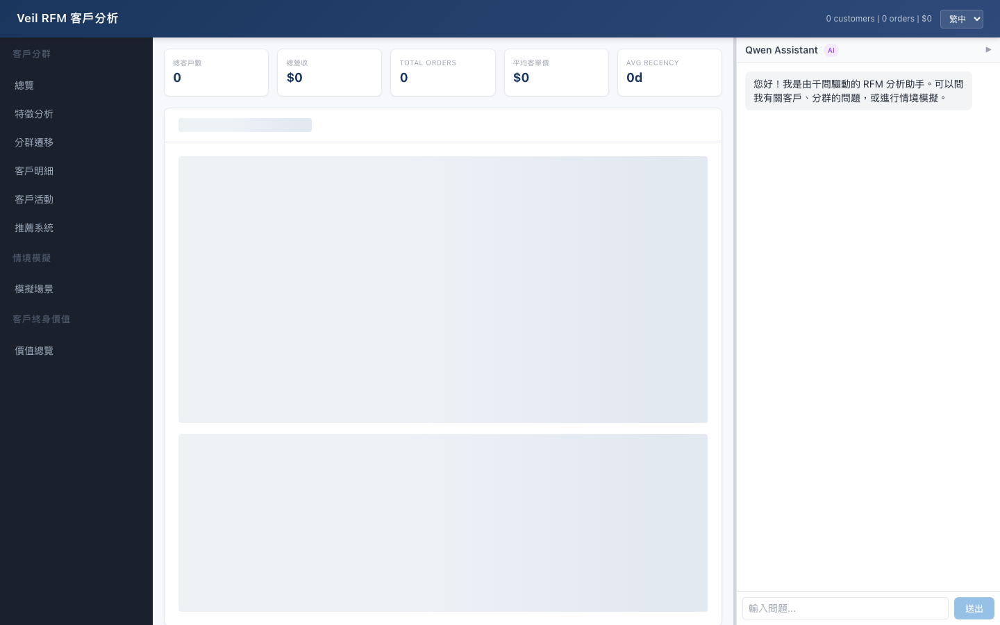
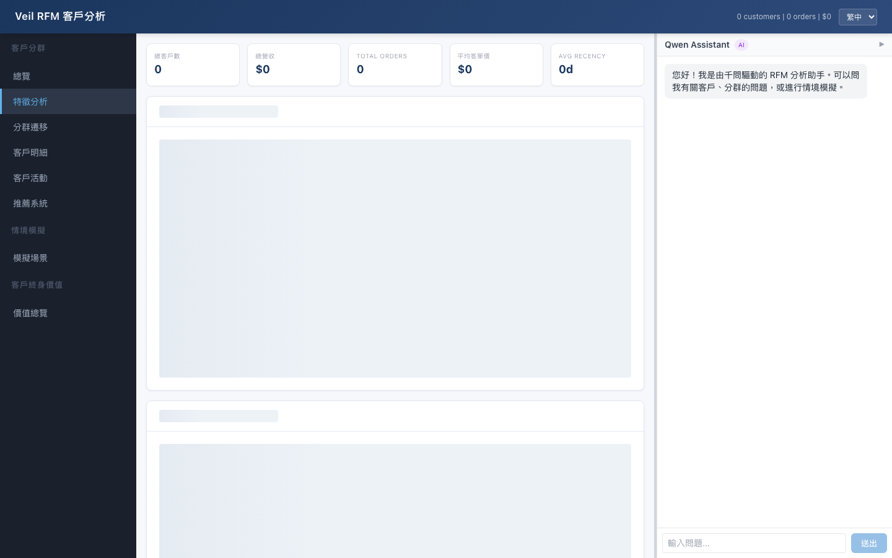
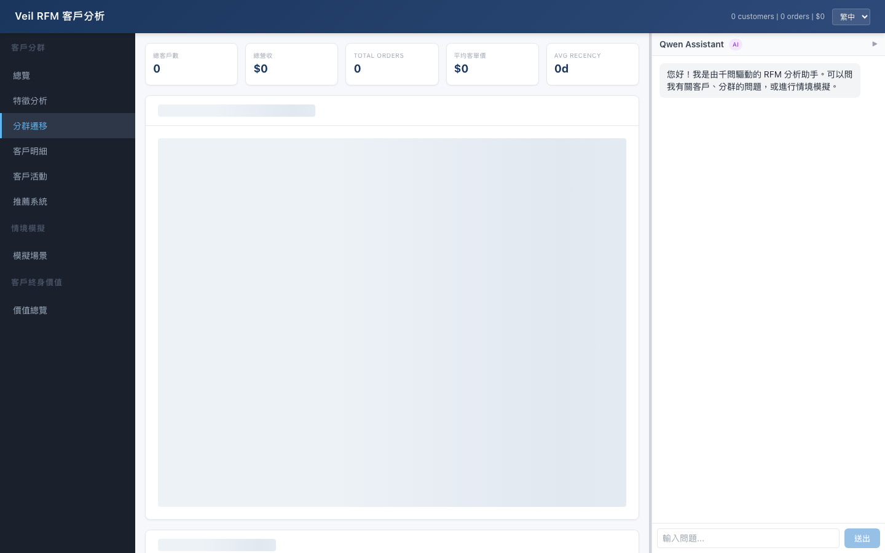
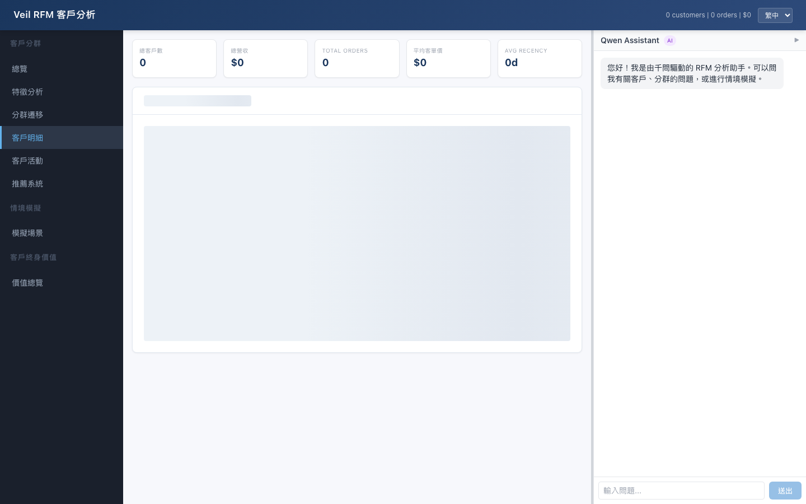
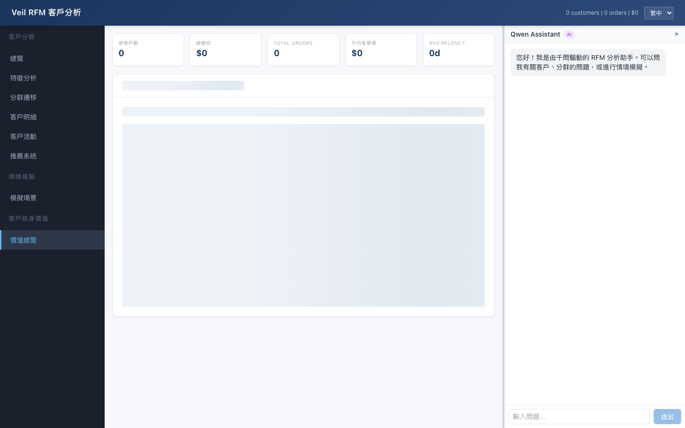
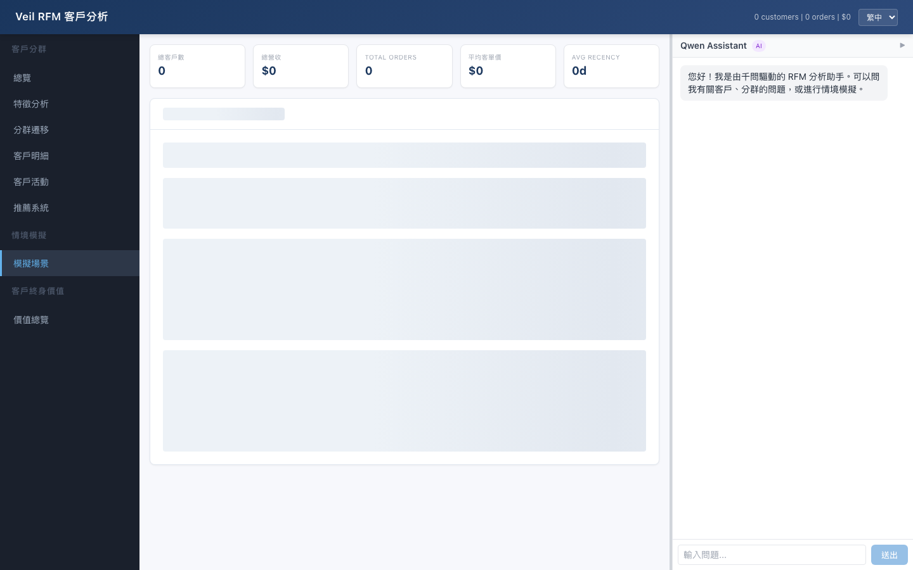
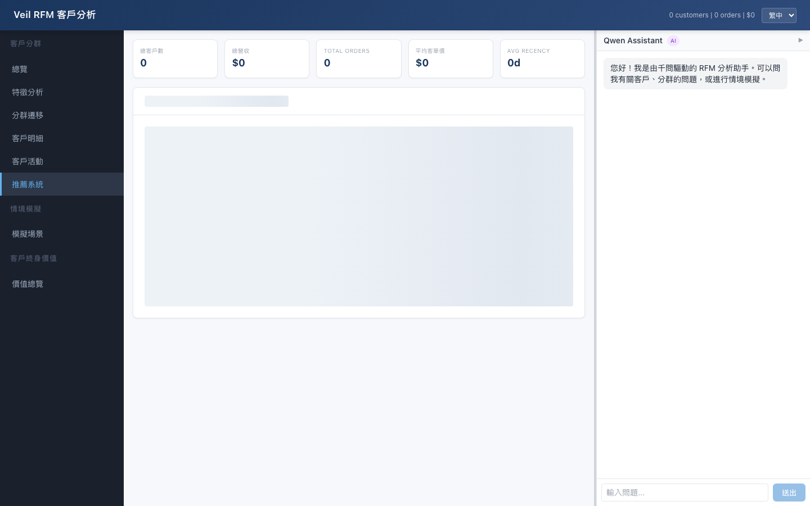
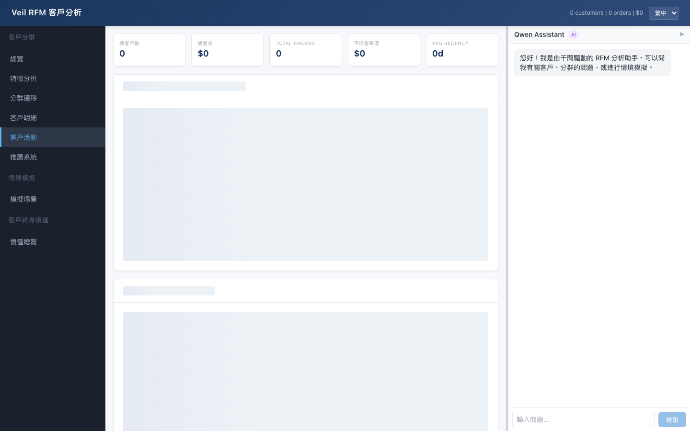

# Veil RFM Analytics

零售客戶分析平台 — RFM 分群、Markov Chain 遷移模型、AI 智慧問答。100% TypeScript，運行於 Cloudflare Workers + Pages + 千問（Qwen）LLM。

從原始 [veil-dotnet](https://github.com/ai-caseylai/veil-dotnet) R/Python 專案分叉並現代化重寫。

## 架構

```
veil-rfm/
├── packages/
│   ├── core/          # 純 TS：RFM 引擎 + Markov Chain + What-If 邏輯
│   ├── worker/        # Cloudflare Worker（REST API + Qwen 聊天機器人代理）
│   └── frontend/      # Cloudflare Pages（React 儀表板）
├── scripts/           # 測試腳本（250 Q&A 驗證）
├── logs/              # 聊天機器人 Q&A 測試日誌
└── sample-data/       # 測試用範例 CSV
```

### 套件：`core`
純商業邏輯，零 I/O，完整單元測試（vitest）。

| 模組 | 原始碼 | 用途 |
|---|---|---|
| `rfm.ts` | 移植自 `findRFM.R` | RFM 評分（1-5）+ 11 分群分類 |
| `markov.ts` | 移植自 `rfmMC.R` | Markov Chain 轉移矩陣 + 預測 |
| `clumpiness.ts` | 移植自 `clumpiness.R` | 事件間隔時間集中度指標 |
| `whatif.ts` | 新增 | What-If 情境模擬引擎 |

### 套件：`worker`
Cloudflare Worker，提供 5 個 REST 端點：

| 端點 | 方法 | 說明 |
|---|---|---|
| `/api/rfm` | POST | 計算 RFM 分數與分群 |
| `/api/rfm/transition` | POST | Markov Chain 轉移機率矩陣 |
| `/api/rfm/predict` | POST | 預測未來分群分佈 |
| `/api/rfm/whatif` | POST | 模擬行為變化影響 |
| `/api/chat` | POST | 千問驅動的聊天機器人（14 個函式呼叫） |
| `/api/health` | GET | 健康檢查 |

**14 個聊天機器人函式呼叫：**
`getCustomerInfo`、`listAllCustomers`、`runWhatIf`、`explainSegment`、`getSegmentDistribution`、`suggestTargetSegment`、`getSegmentStats`、`getAtRiskCustomers`、`compareCustomers`、`getCustomersByFilter`、`getRevenueBySegment`、`getNewVsReturning`、`getSummaryStats`、`getSegmentMigration`

### 套件：`frontend`
React 18 + TypeScript 儀表板，支援三語 i18n（EN / 繁體中文 / 簡體中文）。

**頁籤結構（對照原始 R Shiny 佈局）：**
- 總覽 — 圓餅圖 + 分群分佈表
- 特徵分析 — 各分群 R/F/M 長條圖、頻率直方圖
- 分群遷移 — 互動式 vis-network 圖 + 預測折線圖
- 客戶明細 — 可篩選資料表，支援 CSV 匯出
- What-If 分析 — 滑桿式模擬 + 目標分群建議
- LTV 總覽 — 各分群平均終身價值長條圖

**右側面板：** 可調整大小的千問聊天機器人，支援多輪對話。

## 操作截圖

| 總覽 | 特徵分析 | 分群遷移 |
|------|----------|----------|
|  |  |  |

| 客戶明細 | LTV (BTYD) | 情境模擬 |
|----------|------------|----------|
|  |  |  |

| 推薦系統 | 客戶活動 |
|----------|----------|
|  |  |

## 快速開始

### 前置需求
- Node.js 20+
- Cloudflare 帳號（供部署用）
- 千問 API 金鑰（從 [DashScope](https://dashscope.aliyuncs.com) 取得，供聊天機器人使用）

### 本地開發

```bash
# 安裝依賴
cd veil-rfm
npm install

# 執行核心單元測試（13 個測試）
npm test

# 啟動 Worker API（localhost:8787）
npm run dev:worker

# 啟動前端（localhost:3000）
npm run dev:frontend
```

### 部署至 Cloudflare

```bash
# 設定千問 API 金鑰（供聊天機器人使用）
npx -w packages/worker wrangler secret put QWEN_API_KEY

# 部署 Worker API
npm run deploy:worker

# 建置並部署前端
VITE_API_URL=https://your-worker.workers.dev npm run build -w packages/frontend
npx -w packages/frontend wrangler pages deploy dist --project-name veil-rfm
```

### 自訂域名

```bash
# 將自訂域名加入 Pages 專案
npx wrangler pages domain add veil-rfm your-domain.com
```

新增 CNAME DNS 記錄指向 `veil-rfm.pages.dev`（代理模式）。

## 使用指南

### 上傳資料

1. 開啟儀表板
2. 前往側邊欄的 **Import / 匯入**
3. 拖放包含以下欄位的 CSV 檔案：
   ```
   MemberID, OrderID, Timestamp, NetPrice, Quantity, ProductID, ProductName, Category
   ```
4. 或點擊 **Load Sample Data** 載入 8 位客戶的範例資料

### 理解 RFM 分群

| # | 分群 | RFM 模式 | 商業行動 |
|---|---|---|---|
| 1 | Best Customers | 555 | VIP 維繫、獨家預覽 |
| 2 | Loyal Customers | ≥444 | 忠誠獎勵、交叉銷售 |
| 3 | Potential Loyalist | ≥333 | 培育活動、里程碑獎勵 |
| 4 | Low-spending Active Loyal | R≥4,F≥4,M≤2 | 捆綁折扣、追加銷售 |
| 5 | High-spending New Customers | R≥4,M≥4,F≤2 | 跟進序列、二次購買折扣 |
| 6 | Almost Lost Customers | R=2-3,F≥4,M≥4 | 立即挽回活動 |
| 7 | Churned Best Customers | R=1,F≥4,M≥4 | 積極挽回、調查原因 |
| 8 | Customers Needing Attention | 混合 | 按品類/渠道細分調查 |
| 9 | About to Sleep Customers | ≤333 | 重新參與活動 |
| 10 | Hibernating Customers | ≤222 | 低成本重啟測試 |
| 11 | Lost Cheap Customers | 111 | 最低行銷投入 |

### 使用聊天機器人

右側聊天機器人由千問 LLM 驅動，配備 14 個函式呼叫。範例問題：

- 「消費金額前 5 名的客戶是誰？」
- 「哪些客戶有流失風險？」
- 「如果 C003 多買 5 次會怎樣？」
- 「比較 C001 和 C004」
- 「各分群貢獻多少營收？」
- 「C008 要怎樣才能變成 Potential Loyalist？」

### 執行 Q&A 驗證

```bash
bash scripts/test-chatbot.sh
```

跨 14 個類別測試 250 個問題。結果儲存於 `logs/`。

## 技術棧

| 層 | 技術 |
|---|---|
| 前端 | React 18、TypeScript、Vite、Tailwind CSS、Recharts、vis-network |
| API | Cloudflare Workers、TypeScript |
| AI 聊天機器人 | Qwen-plus via DashScope（OpenAI 相容） |
| 測試 | Vitest |
| 部署 | Wrangler（Workers + Pages） |
| i18n | 自訂 React context（en / zh-TW / zh-CN） |

## 專案結構

```
packages/core/src/
├── index.ts           # 桶狀匯出
├── types.ts           # TypeScript 介面 + 11 分群常數
├── rfm.ts             # RFM 評分引擎
├── markov.ts          # Markov Chain 轉移引擎
├── clumpiness.ts      # 集中度指標
└── whatif.ts          # What-If 模擬引擎

packages/worker/src/
├── index.ts           # Worker 入口 + REST 端點
└── chat.ts            # Qwen 聊天機器人代理 + 14 個函式實作

packages/frontend/src/
├── main.tsx           # 入口點 + i18n 提供者
├── App.tsx            # 外殼：頁首、側邊欄、KPI 列、路由
├── index.css          # 企業級設計系統
├── lib/
│   ├── api.ts         # API 客戶端
│   ├── i18n.ts        # 三語翻譯
│   ├── parse.ts       # CSV 解析器（Papa Parse）
│   └── sampleData.ts  # 內嵌範例交易資料
├── components/
│   ├── ChatBot.tsx    # Qwen 聊天機器人面板（可調整大小）
│   ├── FileUpload.tsx # CSV 拖放上傳
│   └── DashboardSections.tsx
└── pages/
    ├── RFMOverview.tsx
    ├── RFMCharacteristics.tsx
    ├── RFMTransition.tsx
    ├── RFMCustomerSummary.tsx
    ├── LTVOverview.tsx
    └── WhatIf.tsx
```

## 已驗證 Q&A 覆蓋率

跨 14 個類別測試 250 個問題，100% 通過率（詳見 `logs/`）：

| 類別 | 問題數 | 狀態 |
|---|---|---|
| 客戶查詢 | 20 | 100% |
| 分群解釋 | 15 | 100% |
| 分群分佈 | 10 | 100% |
| 排行榜 | 20 | 100% |
| What-If 模擬 | 25 | 100% |
| 流失與風險 | 20 | 100% |
| 營收分析 | 20 | 100% |
| 客戶對比 | 15 | 100% |
| 篩選與搜尋 | 20 | 100% |
| 新客 vs 回購 | 10 | 100% |
| 摘要與 KPI | 15 | 100% |
| 遷移與轉換 | 15 | 100% |
| 商業行動 | 25 | 100% |
| 邊界案例 | 20 | 100% |
| **總計** | **250** | **100%** |
